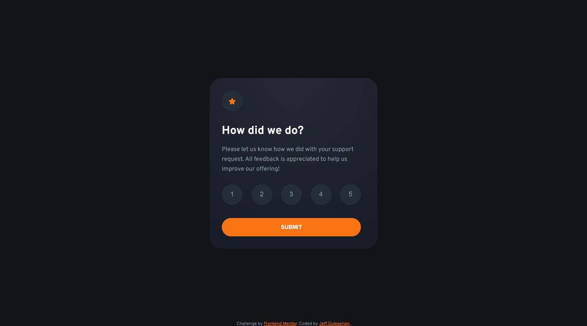
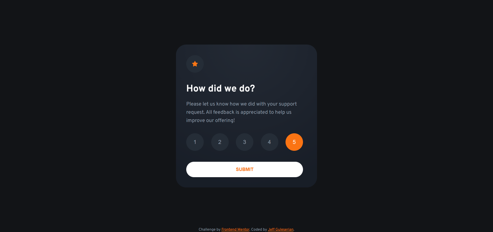
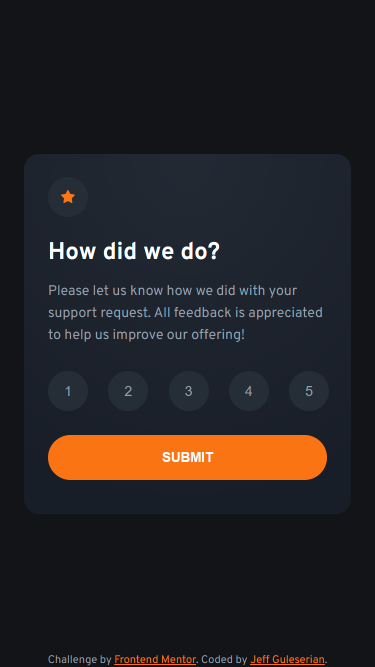

# Frontend Mentor - Interactive rating component solution

This is a solution to the [Interactive rating component challenge on Frontend Mentor](https://www.frontendmentor.io/challenges/interactive-rating-component-koxpeBUmI). Frontend Mentor challenges help you improve your coding skills by building realistic projects. 

## Table of contents

- [Overview](#overview)
  - [The challenge](#the-challenge)
  - [Screenshot](#screenshot)
  - [Links](#links)
- [My process](#my-process)
  - [Built with](#built-with)
  - [What I learned](#what-i-learned)
  - [Continued development](#continued-development)
  - [Useful resources](#useful-resources)
- [Author](#author)
- [Acknowledgments](#acknowledgments)

## Overview

For a small project, the Interactive rating component has a few challenges, especially with respect to the JavaScript component. See "challenge" below.

From a design perspective, there were a lot of choices from the HTML that would preclude a particular solution in the JavaScript, or in this case, JQuery. For example, the rating buttons could be one of several types of tags, as long as the tag was able to hold a "value" such as <li> <input> <button>, etc. On the other hand, since whatever is received is just a string, the JavaScript could bring over the innerText of any element that contained text. Then, one could insert it into the final rating paragraph.

### The challenge

Frontend Mentor Challenges: users should be able to:

- View the optimal layout for the app depending on their device's screen size
- See hover states for all interactive elements on the page
- Select and submit a number rating
- See the "Thank you" card state after submitting a rating

Personal challenges:
- To improve user experience and feedback, 
  - I wanted the rating buttons to stay highlighted in orange after they were clicked. 
  - If the user changed their rating, clicking a new button should clear any other button that had been clicked so only one would remain highlighted.
  - Finally, I didn't want the "SUBMIT" button to fire prematurely and miss taking in the rating, so I made it check to make sure a rating had been given before moving on.
- Use jQuery to complete a challenge

### Screenshot

### Links

- Solution URL: [GitHub Repository](https://github.com/jguleserian/FMC-InteractiveRatingComponent.git)
- Live Site URL: [GitHub Pages](https://jguleserian/github.com/FMC-InteractiveRatingComponent/)

## My process

No changes to previous workflows.

### Built with

- Semantic HTML5 markup
- CSS custom properties
- Flexbox
- CSS Grid
- Mobile-first workflow
- jQuery

### What I learned

In this project, I advanced in proficiency with respect to a couple of issues:
1. Writing jQuery to manipulate the DOM
2. Understanding what tag elements can hold a .value property to be transferred to the JS application
3. Determining the true margin and padding between elements when taking into account the line height property

### Continued development

Continued development:
- More advanced CSS and JavaScript utilization
- Integrating databases and backend development
- Improving my use and understanding of GitHub - I want to try and set up a server-side configuration and see how it works

### Useful resources

- [jQuery Documentation](https://api.jquery.com/) - This was helpful for looking up the syntax of the newer v.3 of jQuery

## Author

- GitHub - [@jguleserian](https://github.com/jguleserian)
- Frontend Mentor - [@jguleserian](https://www.frontendmentor.io/profile/jguleserian)
- LinkedIn - [@jeffguleserian](https://www.twitter.com/yourusername)
- FreeCodeCame - [@Doctor_G](https://www.freecodecamp.org/Doctor_G)

## Acknowledgments

As always, I am apprreciative to everyone who has given me constructive feedback through Frondend Mentor.
